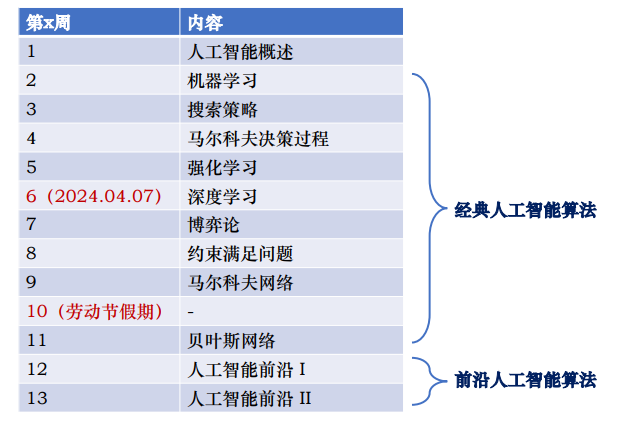
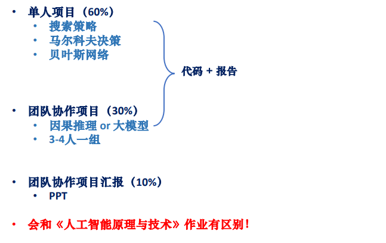

# 课前须知

## 课程信息

  
  

   课程信息
  

## 前置课程/能力
- [x] `Python`
  > - 流行的编程语言：机器学习、深度学习、大模型…
  > - 课程作业必备！
  > - 强烈建议花1-2周左右的时间学习！
  > > - https://colab.research.google.com/drive/1-9Z_dLRJBWZdKaMNLqBMF9TrXc1553IK?usp=sharing

- [x] `LaTex`
  > - 流行的学术写作语言：学术论文、课程作业

## 课程打分(拟)

  
  

   课程打分
  

# 第一章 人工智能概述

# 第二章 机器学习
